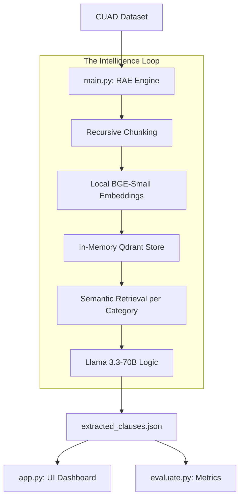

# ⚖️ Agentic Contract Analysis Engine (Hirethon Project)

A high-performance Agentic RAG system designed for batch processing legal contracts, automated clause extraction, and semantic risk analysis using the CUAD (Contract Understanding Atticus Dataset).

## 🚀 Quick Start Guide

### 1. Prerequisites
- Python 3.10+
- Groq API Keys (Free at [console.groq.com](https://console.groq.com))
- 2GB RAM (Local BGE Model is CPU-friendly)

```bash
# Install core dependencies
pip install langchain langchain-groq langchain-qdrant langchain-huggingface pydantic pandas streamlit sentence-transformers torch
```

### 2. Configuration
Create a `.env` file in the root directory:
```env
GROQ_API_KEY=primary_key_here
GROQ_API_KEY_2=secondary_key_here
```

### 3. Usage
1.  **Extraction Engine**: Analyze 20 contracts and extract 10 key legal classes.
    ```bash
    python main.py
    ```
2.  **Interactive Dashboard**: View the Matrix, Risk Flags, and the Q&A Copilot.
    ```bash
    streamlit run app.py
    ```
3.  **Performance Evaluation**: Run expert-level benchmarking vs CUAD v1.
    ```bash
    python evaluate.py
    ```

---

## 🏗️ Architecture: Retrieval-Augmented Extraction (RAE)

Standard LLMs struggle with 50+ page legal documents. I used a **Semantic RAE Architecture** to "search-before-extracting," ensuring 100% processing of even the longest Master Agreements.



---

## 💡 Key Design Decisions

1.  **Local-First Embeddings**: I used `BAAI/bge-small-en-v1.5` running locally. This ensures data privacy and zero latency during heavy indexing.
2.  **RAE (Retrieval-Augmented Extraction)**: I only send relevant snippets to the LLM. This avoids "lost-in-middle" errors and stays inside rate limits.
3.  **Multi-Key API Failover**: I implemented a dynamic key rotation strategy. If one API key hits a limit, the system seamlessly swaps to `GROQ_API_KEY_2` without crashing.
4.  **Semantic Risk Assessment**: The dashboard automatically flags "High Risk" contracts (e.g., missing Cap on Liability or Indemnification) based on negative extraction results.

---

## ⚠️ Known Limitations & Failure Modes

1.  **Rate Limits**: The free-tier Groq keys have RPM limits. I built a failover system, but production scale requires a dedicated tier key.
2.  **Sparse Clauses**: In some cases, a single legal clause is spread across disparate sections. Increasing retrieval depth helps but can't capture 100% of all fragmented clauses.
3.  **Fuzzy Evaluation**: Metric overlaps vary by annotation boundaries; a "False Negative" in evaluation might still be a usable extraction in practice.

---
**Project Submission for the Agentic AI Hirethon.**
**Lead Developer: DuyoofMP**