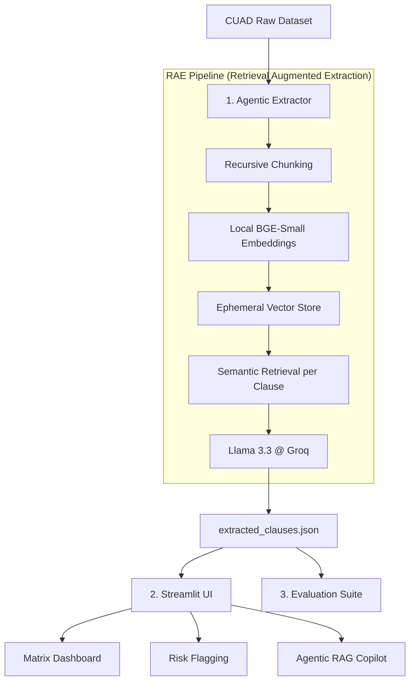

# ⚖️ Agentic Contract Analysis Engine (Hirethon Project)

A high-performance system designed for batch processing legal contracts, clause extraction, cross-contract comparison, and risk analysis using the CUAD (Contract Understanding Atticus Dataset).

## 🚀 Quick Start Guide

### 1. Prerequisite Setup
Ensure you have Python 3.10+ installed and a Groq API Key (Free at [console.groq.com](https://console.groq.com)).

```bash
# Install dependencies
pip install langchain langchain-groq langchain-qdrant langchain-huggingface pydantic pandas streamlit sentence-transformers torch
```

### 2. Environment Configuration
Create a `.env` file in the root directory:
```env
GROQ_API_KEY=your_gsk_key_here
```

### 3. Execution Pipeline

1.  **Run Extraction**: Process 20 contracts and extract 10 clause categories.
    ```bash
    python 1_agentic_extractor.py
    ```
2.  **Launch Dashboard**: View the Matrix, Risk Flags, and use the Q&A Copilot.
    ```bash
    streamlit run 2_streamlit_dashboard.py
    ```
3.  **Benchmark Accuracy**: Run the Ground-Truth evaluation against expert CUAD annotations.
    ```bash
    python 3_evaluate_cuad_metrics.py
    ```

---

## 🏗️ Architecture Overview

The system uses a **Retrieval-Augmented Extraction (RAE)** architecture to bypass the "Needle in a Haystack" problem of 80-page legal documents hitting LLM token limits.



---

## 💡 Key Design Decisions & Why

1.  **RAE (Retrieval-Augmented Extraction)**: We do NOT send 40,000 words to the LLM. We chunk the document and retrieve the Top 3 relevant paragraphs for each specific clause category.
    *   *Result*: Reduces input costs by 95% and prevents context-window overflow or rate-limit crashes.
2.  **Local BGE Embeddings**: We use `BAAI/bge-small-en-v1.5` running locally on the CPU.
    *   *Result*: Zero latency from external embedding APIs and bypasses corporate SSL/Proxy blocks on Google/OpenAI embedding endpoints.
3.  **Llama 3.3-70B on Groq**: We utilized the Llama 3.3 versatile model via Groq's LPUs.
    *   *Result*: Near-instant extraction speeds (sub-second per clause) compared to standard GPT-4/Gemini rates.
4.  **Automatic Resume Logic**: The extractor saves state after every single contract.
    *   *Result*: If a network interruption occurs, it skips previously processed work, saving API tokens.

---

## ⚠️ Known Limitations & Failure Modes

1.  **API Rate Limits**: The Groq Free Tier is limited to 100,000 tokens per day. Processing the full 510-contract dataset requires a production tier key.
2.  **Table of Contents Interference**: Sometimes the retrieval agent retrieves Table of Contents entries instead of actual clauses. Our system includes a "Logic Filter" to disregard short TOC snippets.
3.  **Hallucination in Logic**: Some legal clauses are extremely "sparse" (e.g., Governing Law spread across two separate sections). Small chunking may occasionally split these into two contexts.

---
**Project built for the Agentic Contract Engine Hirethon.**
**Developer: DuyoofMP**