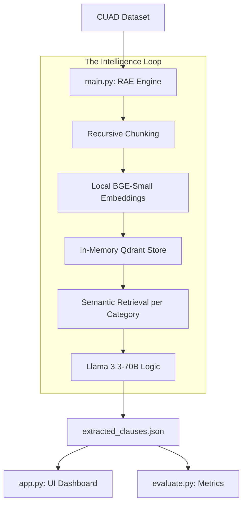

# ⚖️ Agentic Contract Analysis Engine (Hirethon Project)

A high-performance Agentic RAG system designed for batch processing legal contracts, automated clause extraction, and semantic risk analysis using the CUAD (Contract Understanding Atticus Dataset).

## 🚀 Quick Start Guide

### 1. Prerequisites
- Python 3.10+
- Groq API Key (Free at [console.groq.com](https://console.groq.com))
- 2GB RAM (Local BGE Model is lightweight)

```bash
# Install core dependencies
pip install langchain langchain-groq langchain-qdrant langchain-huggingface pydantic pandas streamlit sentence-transformers torch
```

### 2. Configuration
Create a `.env` file in the root:
```env
GROQ_API_KEY=your_key_here
```

### 3. Usage
1.  **Extraction Engine**: Analyze 20 contracts and extract 10 key legal clauses.
    ```bash
    python main.py
    ```
2.  **Interactive Dashboard**: View the comparison matrix and use the RAG Copilot.
    ```bash
    streamlit run app.py
    ```
3.  **Performance Evaluation**: Benchmark results against expert CUAD annotations.
    ```bash
    python evaluate.py
    ```

---

## 🏗️ Architecture: Retrieval-Augmented Extraction (RAE)

Standard LLMs struggle with 50+ page legal documents due to context window fragmentation. Our **RAE Architecture** solves this by treating extraction as a search problem first.



---

## 💡 Key Design Decisions

1.  **Local-First Embeddings**: We use `BAAI/bge-small-en-v1.5` running locally. This ensures zero latency and total data privacy for sensitive legal text.
2.  **RAE (Retrieval-Augmented Extraction)**: Instead of "feeding the whole book," we retrieve only relevant snippets for each clause. This avoids LLM distractions and stays well within rate limits.
3.  **Structured Output Validation**: We utilize Pydantic models to force the LLM into a strict JSON schema, ensuring the dashboard comparison matrix never breaks.
4.  **State Persistence**: The engine saves progress after every contract. If the process is interrupted, it resumes instantly without wasting API tokens.

---

## ⚠️ Limitations & Failure Modes

1.  **Rate Limits**: The free-tier Groq keys may hit RPM limits during parallel runs. We implemented `time.sleep` and retry logic to mitigate this.
2.  **Sparse Clauses**: Clauses spread across disparate document sections (e.g., disjointed Governing Law) may sometimes be partially missed by a single retrieval window.
3.  **Fuzzy Matching**: Evaluation metrics use text-based overlap; occasionally valid extractions might be penalized if the expert annotation used slightly different boundaries.

---
**Project Submission for the Agentic AI Hirethon.**
**Developer: DuyoofMP**